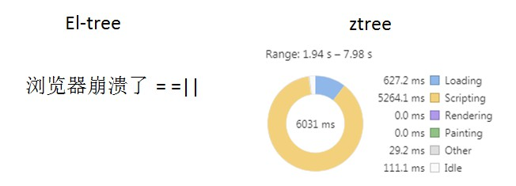

# Element-UI树组件和ztree组件的性能对比分析报告

## 背景
从jQuery库迁至Vue框架后，相应的功能组件也需要找到新的替代方案。树组件一般用于展示具有层级关系、职能结构的数据，如果项目大，数据量大，比如需要展示某两万人的公司的全体员工。在使用jQuery的项目中，使用ztree组件进行展示和操作，好像并没有什么问题。但是转到Vue技术，项目使用了Element-UI后，el-tree树组件性能就存在很明显的问题，特别是在IE浏览器下，简直可以卡到你怀疑人生。  
那么，el-tree相比ztree性能究竟差多少呢？我们这么进行两个组件库的性能对比。

## 准备工作
* 我们使用`vue-cli`脚手架来帮助我们生成一个基础项目；
```
vue init webpack eltree_ztree
```
* 安装需要用到的插件。其中，我们采用axios来发送http请求。
```
npm install axios element-ui ztree --save
```
* 安装ztree时会自动安装jQuery，之后我们需要在`/build/webpack.dev.conf.js`中进行配置，这样我们才能在全局使用`$`和`window.jQuery`变量；
* 我们使用Easy Mock平台来模拟后台数据。因为Mock可以创建动态数据，我们在data中定义一个函数，根据请求传入的节点数来动态生成对应数量级的、具有一定层级关系的节点数据，方便进行不同数量级节点下的性能比对。另外设置请求代理就不多说了。
* 数据方面。两种树请求的同一批数据，只有一个根节点，并且根节点会在初始化时默认展开。节点有4层。
* 我们主要使用chrome浏览器中DevTools下的Performance进行性能分析（这个好像是默认启用的，如果打开F12没有这一项，需要在setting中配置启用）。
* 为了保证对比的合理性，我们将采用两个路由分别渲染el-tree和ztree节点数据，并且按需加载需要用到的库文件。

## 性能图简述
我们先写一个什么都没有的页面组件`default`，监听页面加载性能，我们可以看到如下图：  
   
这里不做performance面板的教学，我们可以在底部的环状图看到整个页面的性能消耗比例。在上面的总览图和火焰图中我们都能看到一条蓝线和一条红线，蓝线代表 DOMContentLoaded 事件，红线代表 load 事件。我们不考虑创建Vue等执行的脚步性能消耗，之后统一从蓝线之后开始统计。  
由于一般项目中都只展开了根节点，那么我们分为初始化渲染、全展开渲染和节点操作三个层面，节点数分为1000,5000,10000三个量级去分析。

## 初始化渲染
1. 1000个节点：流畅  

   

2. 5000个节点：流畅 

   

3. 10000个节点：ztree稍有卡顿，el-tree卡顿严重  

   

### 分析
就算只open一层节点，也能看出，节点数据大的情况下el-tree就开始比ztree要卡很多，两者在renderer上都没有花多少时间（因为就renderer了几个节点），但是在执行脚本上el-tree明显更加损耗性能。

## 全展开渲染
> 全展开的意思是节点就是将所有节点的open属性置为true，相当于初始化渲染的时候，就渲染所有节点。
1. 1000个节点：流畅  

   

2. 5000个节点：ztree流畅，el-tree卡顿严重  

   

3. 10000个节点：ztree稍有卡顿，el-tree把浏览器卡崩了  

   

### 分析
在节点全部展开的时候，性能对比就非常明显了。我们拿5000个节点的样本来看，相比只展开一层节点，el-tree在全节点展开下script执行时间是之前的3倍，达到了31秒，ztree只有2秒，比初始化渲染只多了0.6秒，很明显，当数据量大的时候，在el-tree的数据操作根据消耗性能。在render上好像两者花费的时间差不多，似乎ztree比el-tree稍微多耗一点时间，可能是ztree还要渲染图片图标的缘故。  
当数据量达到10000的时候，el-tree直接把chrome浏览器给整崩溃了。

## 节点操作
> 我们还是只展开一层节点，将节点设置为勾选模式（有勾选框），操作包括勾选根节点和展开某组节点。

1. 1000个节点：流畅

  

2. 5000个节点：流畅

 

3. 10000个节点：ztree流畅，el-tree稍有卡顿

 

### 分析
在操作节点时，节点的数量级增加对性能的影响似乎没有非常明显，但是两个组件对比来看，ztree还是明显占据上风。还是拿5000个点分析，el-tree依然脚本执行时间要大于渲染时间，相比下，ztree的脚本执行效率就高了很多。


## 总览
由上面的分析图可知，实际页面render的时间不长，都能控制在2秒以内，renderer主要是渲染节点到页面上，相对来说大数据情况下，el-tree的渲染时间明显高于ztree，那是因为el-tree的节点dom结构要比ztree的要复杂的多。  
我们主要还是关注一下脚本（scripting）执行时间。  
1. 初始化渲染

| 节点数量级（个） | el-tree（毫秒） | ztree（毫秒） |
| -------------- | --------------- | ------------ |
| 1000 | 298 | 264 |
| 5000 | 11500 | 1565 |
| 10000 | 71196 | 5291 |

2. 全展开渲染

| 节点数量级（个） | el-tree（毫秒） | ztree（毫秒） |
| -------------- | --------------- | ------------ |
| 1000 | 2425 | 474 |
| 5000 | 31203 | 2200 |
| 10000 | - | 5214 |

3. 节点操作

| 节点数量级（个） | el-tree（毫秒） | ztree（毫秒） |
| -------------- | --------------- | ------------ |
| 1000 | 2056 | 100 |
| 5000 | 2436 | 432 |
| 10000 | 2880 | 580 |

## 结果报告
由上可知，ztree的性能大大优于el-tree组件，主要表现在脚本执行时间，在一次同时渲染节点数量级大的情况下，体现非常明显。并且，el-tree在节点数10000时,chrome浏览器下会直接崩溃，ztree的节点临界值高（据之前项目经验，在节点数十万的情况下，浏览器会非常卡，但是不会崩溃）。
