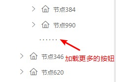

# Element-UI树组件异步化渲染方案

## 前言
Element-ui是基于VUE前端框架开发的一款UI组件库，易用性和美观程度都非常不错。最近的公司项目基于其Element定制化制作了一款UI组件库供公司内部项目使用，其核心组件和代码都和Element-ui大同小异。
由于Element-ui的部分组件涉及数据渲染，当大数据量的情况下（如10000条及其以上数据），由于一次渲染的数据节点数过大，会导致交互响应缓慢、卡顿甚至浏览器奔溃的情况，且在IE浏览器下表现尤其明显。这个不仅影响用户体验，严重时会造成阻塞性的问题。考虑到大数据量时的性能优化问题，这里就树形控件（Tree）设计了一款优化方案。

## tree组件
首先我们来看看element-ui的Tree组件给我们提供的属性。  
在常规的使用中，我们一般将data数据传入组件，组件监听并解析data，将里面的节点按照格式规范渲染在页面上。我们给10个节点，组件就渲染10个；我们给100个节点，组件就渲染100个。那试想一下，如果我们一次给10000个节点，组件还是勤勤恳恳的直接渲染一万个，在IE下就直接卡崩了。  
一般我们处理这种情况，都是采用异步渲染的方案，就是分步渲染，一次只渲染一部分。Tree组件确实也给我提供了这种方法，只需要将`lazy`传入true，并传入一个`load`函数，其中参数`resolve`回调函数需要带上要渲染的数据。函数可参看如下：
```
/* 异步加载函数 */
load (treeNode, resolve) {
  let nextNodes = api.getData(treeNode.data)
  resolve(nextNodes)
}
```
新版的Element-ui已经也提供了一个名为`render-after-expand`的属性，作用为是否在第一次展开某个树节点后才渲染其子节点。也可以实现异步渲染的这个一个过程。但是，这些都只能解决一部分问题。如果某个节点下，就有5000个节点，那不是照样得一次渲染5000条数据，该有的性能问题一样会复现。考虑到这种情况，Element原来的这些配置属性就不管用了，得稍微包装一下。

## 异步获取，分页渲染
方案的核心思想都是分布来渲染数据，减小每次渲染时对浏览器的压力。这里主要有两种维度。
* 子节点异步。即每次只加载一层节点，当展开某个节点时，才加载下一层；
* 同级节点分页。即加载每层节点的时候，一次只加载前100条数据，当用户操作加载更多的时候，才加载下100条。

首先，我们需要引入组件
```
<el-tree
  ref="tree"
  :data="data"
  lazy
  :load="loadData"
  :render-content="renderTreeContent"
>
```
  
```
loadData (treeNode, resolve) {
  let nextNodes = api.getData(treeNode.data)
  resolve(nextNodes)
}
```
这样一来，子节点异步就实现了，接下来是同级节点分页。我们先引入一个交互按钮，名为加载更多，如下图：  
  
`loadData`中获取的是子节点第一页的数据，用户点击这个......的时候，就会继续加载第二页的数据，然后在尾部继续添加这个按钮，再点击就会加载第三页，以此类推。  
这里的按钮实际是一个虚拟的节点，这样能更好把控它的位置、样式和数据传递。那么，我们就要对`loadData`函数进行一波改造，让它在请求到第一页数据的时候，如果还存在数据，就插入一个虚拟的节点。
```
loadData (treeNode, resolve) {
  let data = api.getData(treeNode.data)  // data: {lastPage: false, rows: [...]}
  let nextNodes = data.rows
  if (!data.lastPage) {
    nextNodes.push(this._createVNode(treeNode.data.id))
  }
  resolve(nextNodes)
}
/* 创建虚拟节点 */
_createVNode (idStr, pageNo = 1, leaf = true) {
  return {
    id: idStr + '$loadmore,
    pageNo,
    leaf
  }
}
```
做完这步后，需要给虚拟节点加一个事件，但放在`node-click`中显然不合适，所以这里我们需要在`render-content`中重写节点的dom。
```
renderTreeContent (h, { node, data, store }) {
  if (node.key.indexOf('$loadmore') !== -1) {
    // 虚拟节点渲染
    return (
      <span
        class="load-more__btn"
        title={this.vNodeTitle}
        onClick={ () => this.append(node.parent.store, node.parent.data, data) }>
        · · · · · ·
      </span>
    )
  } else {
    return (
      <span>{data.name}</span>
    )
  }
}
```
然后给上`append`事件
```
append (store, parentData, vData) {
  let data = api.getData()
   // 遍历插入新获取的节点
  for (let value of data.rows) {
    store.append(value, parentData)
  }
  // 移除本次操作的虚拟节点
  store.remove(vData)
  // 不为最后一页（还有节点），插入新的虚拟节点
  if (!data.lastPage) {
    store.append(this._createVNode(parentData[nodeKey], pageNo), parentData)
  }
}
```
这样，异步的基本功能就实现了。最后，要处理一些小问题：  
* 需要用`before-click`属性来使虚拟节点的常规点击事件失效；
* 需要借助CSS来掩盖和优化一些功能，如隐藏虚拟节点的默认图标、勾选框和hover颜色；
* 最重要的一点，如果每次分页获取到的数据是从服务器获取的，那么需要后台人员将数据封装成前端需要的格式。

## 同步获取，分页渲染
异步获取的方法有一个问题，就是如果节点有勾选的需求时，由于前端并不知道完整的数据情况，导致拿不到一些关键性的数据，比如，勾选节点的总数（当然要包括没有被渲染上的节点）。如此一来以上的方案就不能用了。别急，我们稍微改造一下。  
同步获取的意思是一次获取所有的数据（比如一次从服务器获取全部数据），然后自己来进行分页。这样就能把控完整的数据情况了。  
首先，定义一个变量wholeData来专门存放完整的数据，总体思路和后台分页模式相同，只不过之前每次从后台获取的分页数据，这次从这个wholeData中去获取，封装成方法如下：
```
_filterPageData (pageNo, pageSize = this.pageSize, pId = null) {
  let nodes = this.wholeData.filter(node => node[this.parentKey] === pId)
  let sliceLength = Math.min(nodes.length, pageNo * pageSize)
  let lastPage = nodes.length <= pageNo * pageSize
  return {
    lastPage,
    rows: nodes.slice((pageNo - 1) * pageSize, sliceLength)
  }
}
```
以上仅实现了分页功能，如果是多选树，需要考虑勾选的功能。  
之后需要去修改之前写的哪些方法，由于代码量比较大，就不贴了，需要注意以下几点：
* 还未渲染到页面的上的节点，需要在渲染的时候就考虑到之前的操作。比如我勾选了父节点，然后我加载这个父节点下面的子节点，那么即使子节点刚刚渲染上来，也应该是勾选状态；
* 有些业务需求中，节点在初始化的时候就是勾选的；
* 要给外部提供方法，可以获取被勾选的所有节点，即使部分节点还没有被渲染到页面上。

## 组件封装
为方便各个业务场景引入这套方案，将整套方案封装成一个VUE组件，抛出属性和方法供各处地方自由选用和配置。  
* 异步获取树配置
```
<template>
  <sync-tree
    ref="syncTree"
    :set-tree-data="setTreeData"
  ></sync-tree>
</template>

import api form '@/api/api'
export default {
  methods: {
    setTreeData ({parentId, pageNo, pageSize, keyWord}) {
      return new Promise(async(resolve, reject) => {
        try {
          let {data} = await api.fetchUnitTree({pId: parentId, pageNo, pageSize})
          resolve(data)
        } catch (err) {
          console.error(err)
        }
      })
    }
  }
}
```

## 总结
性能问题是在项目中非常重要的一点，一般前端涉及到的性能问题比较少，所以性能优化意识并不强。然而在实际用户量、数据量或者访问量巨大的情况下，性能问题尤为重要。  
本次案例的特点在于用组件的形式封装实现了树的异步优化，大大简化了调用处的工作量，只需要按需进行配置即可。不过本案例由于是完成整体框架后不断填充新需求，以至于数据层面上考虑不足，部分功能耦合性太强，缺少数据绑定导致调用起来不够灵活，这是本案例需要继续优化和提升的方面。
