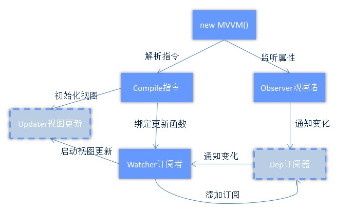
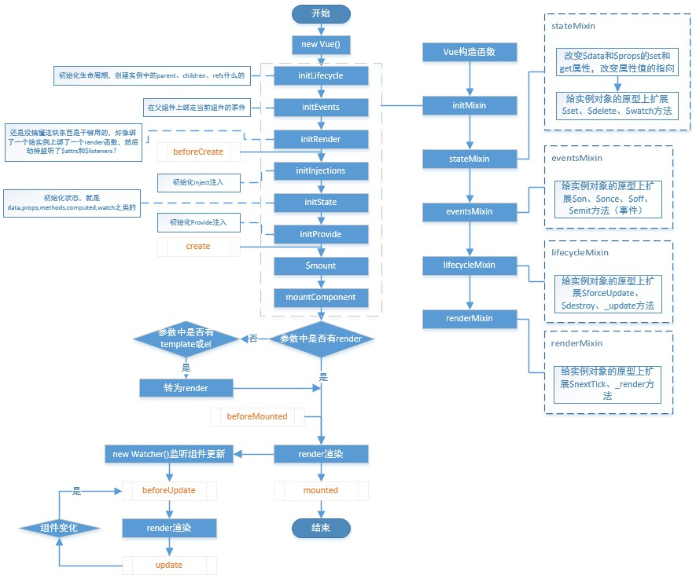

# VUE源码实践
之前都是重复业务的东西，或者学习新的框架，觉得还是需要学习一些底层的东西。说实话打开vue源码的时候我是懵逼的，不知道从哪里下手，刚开始看的是instance生命周期的部分，看的初始化组件的部分，就涉及到了mvvm的现实。  
## MVVM实践
该部分代码主要也是参考网上的（好像是vue1.x的部分，2.0好像用了虚拟dom以后指令部分不一样了），自己完完全全敲了一遍，理解，跑通，看到效果。代码放在这里[完整代码](../code/vue源码实践/index.html)  
代码我就不作分析了，以下是我个人的理解： 
整个过程是一个观察者、订阅器、订阅者、指令器四部分的事情，各司其职。  
  
* Observer观察者部分主要是劫持属性，采用ES5方法`Object.defineProperty`这个应该是大家都熟悉的了，在`set`函数中，当发现属性值有所改变的时候，通知订阅者
* Dep订阅器做的通知内部存在的订阅者
* Compile指令在初始化的时候，解析元素上的指令信息，包括v-text,v-html,v-model等，解析要监听的属性值，然后创建订阅者，初始化页面上的视图；
* Watcher订阅者主要执行的就是，收到更新指令后，更新视图
## 生命周期分析
`src/core/*`文件夹下是vue的核心代码，让我们来看看vue实例从new出来以后都干了什么事。网上找了很多都是零零散散的代码片段分析，而且有不同版本的，我拉的是18年6月12日的版本，结合自己的理解，简单说一下吧。  
首先来张图（自己花了3天画的 - -''）  
  
首先找到`src/core/instance/index.js`文件中的Vue构造函数，里面直接调用了原型方法`_init`，在`_init`方法中，调用了从一系列初始化函数，所列如下：
* `initLifecycle`初始生命周期，里面给实例对象上加了parent、children、ref等内容
* `intiEvents`在父组件上绑定当前组件的事件
* `initRender`这个我还是不太明白干了什么，好像是先给实例对象绑了一个render函数，然后劫持监听了$attrs、$lisenter？
* `initInjections`初始化inject注入（v2.2.0版本新增）
* `initState`初始化data、props、methods、watch之类属性
* `initProvide`初始化provide（和inject是同一套）  
做完了这些后，进入`$mount`方法啦。  
在vue的渲染机制中，如果最终都是通过render方法渲染到页面上，如果采用的是template或者el，或先转成render的形式，从v2.x开始，vue采用vnode机制（关于虚拟DOM的内容还没有研究，之后再解读）。在mounted之前，页面还开启了组件更新的监听，当组件变化的时候update组件。  